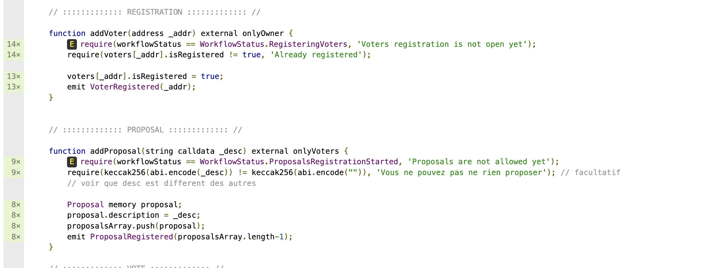
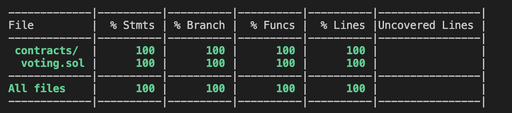

## Tests 

2 projets de tests ont été réalisés : 
    - avec truffle : dossier courant   
    - avec hardhat : dossier hardhat-test 

Les tests sont presques les mêmes entre les 2 projets (hardhat m'a permis de voir que certaines lignes de code n'étaient pas testées donc il y a un peu plus de tests dans le dossier hardhat-test)

# Structure des tests 
1 Tests onlyOwner modifier 
On verifie que les fonctions ne sont pas accessible par un utilisateur qui n'est pas le propriétaire du contrat

2 Tests onlyVoter modifier 
On verifie que les fonctions ne sont pas accessible par un utilisateur qui n'est pas dans la liste des votants

3 Tests du workflow 
On test ici que l'ordre des étapes est respecté
On test aussi les comportements "classiques" du vote :
    - cas normal
    - cas particulier où il y a égalité entre 2 propositions

J'avais commencé à utilisé truffleAssert, j'ai passé les tests avec la lib de openZeppelin (il en reste peut-être avec truffleassert).
Je préfère truffleAssert : il dit quel est la ligne où le test a échoué (alors que expectRevert ne dit pas où est le problème, ça peeut être compliqué le jour ou on modifie le smart contract et que plusieurs tests échouent)

Est-ce qu'une des 2 lib est plus utilisée que l'autre ?

# Voting hardhat test project

Test du contrat voting via hardhat

L'idée d'utiliser hardhat est de pouvoir tester le contrat Voting et de connaitre la couverture de code des tests.

Une fois le plugin solidity-coverage installé, j'ai pu voir que le contrat Voting n'était pas testé à 100%.

Une fois avoir analysé le fichier html voting.sol.html :

j'ai pu voir quels étaient les lignes de code non testées et les ajoutés dans le test pour arriver a 100% de couverture de code.

# GAS REPORT
