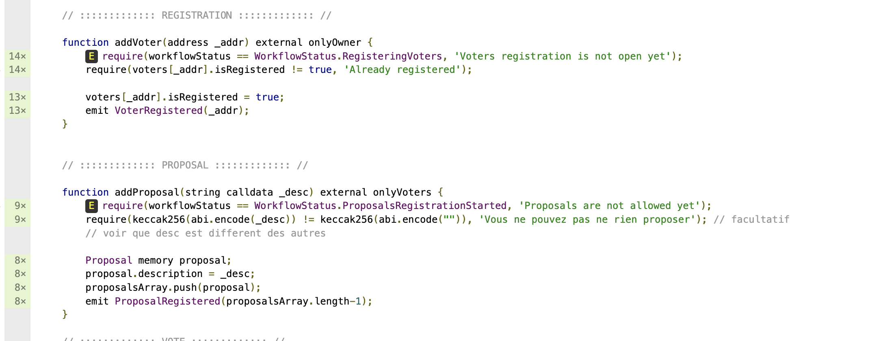

# Voting hardhat test project

Test du contrat voting via hardhat

L'idée d'utiliser hardhat est de pouvoir tester le contrat Voting et de connaitre la couverture de code des tests.

Une fois le plugin solidity-coverage installé, j'ai pu voir que le contrat Voting n'était pas testé à 100%.

Une fois avoir analysé le fichier html voting.sol.html :

j'ai pu voir quels étaient les lignes de code non testées et les ajoutés dans le test pour arriver a 100% de couverture de code.

